# BÁO CÁO ĐỀ TÀI: KNOWLEDGE GRAPH TRONG HỆ THỐNG GỢI Ý ĐIỆN ẢNH
## MÔ HÌNH MẠNG CHÚ Ý TƯƠNG TÁC CKAN (COLLABORATIVE KNOWLEDGE-AWARE ATTENTIVE NETWORK)
### HỌC PHẦN: HỆ HỖ TRỢ RA QUYẾT ĐỊNH (DSS) — TRƯỜNG ĐẠI HỌC BÁCH KHOA

---

## TỔNG QUAN TÀI LIỆU VÀ SẢN PHẨM BÀN GIAO

1. **File Báo Cáo Word chính thức**: 
   - [Bao_cao_cuoi_ky_Knowledge_Graph_CKAN_Movie_Recommender.docx](file:///D:/Study_space/Ki9/DSS/Project/Knowledge_Graph/Movie-Recommendation-System/dss_ckan_movie_recommender_system/docs/Bao_cao_cuoi_ky_Knowledge_Graph_CKAN_Movie_Recommender.docx)
   - Định dạng chuẩn học thuật Đại học Bách Khoa (Times New Roman, lề 3-2-2-2, 16 hình minh họa sắc nét, 10 bảng biểu phân tích).
2. **Notebook Huấn Luyện & Benchmark Đa Mô Hình (Google Colab GPU)**:
   - [CKAN_Benchmark_Comparison_Colab.ipynb](file:///D:/Study_space/Ki9/DSS/Project/Knowledge_Graph/Movie-Recommendation-System/dss_ckan_movie_recommender_system/notebooks/CKAN_Benchmark_Comparison_Colab.ipynb)
   - Tích hợp 4 mô hình: **MostPopular**, **Item-KNN**, **Matrix Factorization (MF)**, và **CKAN (With KG)**.
   - Thử nghiệm độ bền vững trên dữ liệu thưa thớt (Data Sparsity: 10%, 20%, 50%, 100%) và khởi đầu lạnh (Cold-Start).
3. **Thư mục Hình ảnh Minh họa Độ Phân Giải Cao (300 DPI)**:
   - Nằm tại: [docs/figures/](file:///D:/Study_space/Ki9/DSS/Project/Knowledge_Graph/Movie-Recommendation-System/dss_ckan_movie_recommender_system/docs/figures/) (Hình 1 đến Hình 16).
4. **Ứng Dụng Demo Thực Tế (Fullstack DSS Cinema)**:
   - **Backend**: FastAPI + PyTorch CKAN + Dynamic Propagation Engine (<5ms).
   - **Graph Database**: Neo4j 5 (102,569 thực thể, 499,474 liên kết tri thức).
   - **Frontend**: React 18 + Vite + Tailwind CSS + Shadcn UI Luxury Dark.

---

## TÓM TẮT NỘI DUNG BÁO CÁO CHI TIẾT

### CHƯƠNG 1: GIỚI THIỆU ĐỀ TÀI
- **Tính cấp thiết**: Trong các dịch vụ xem phim trực tuyến, người dùng bị quá tải thông tin. Lọc cộng tác truyền thống (CF/MF) bị hạn chế nghiêm trọng bởi dữ liệu thưa thớt (Sparsity > 99.4%) và khởi đầu lạnh (Cold-Start). Đồ thị tri thức (KG) là chiếc cầu nối ngữ nghĩa cứu cánh, liên kết các thực thể điện ảnh để mang lại gợi ý chuẩn xác và minh bạch.
- **Mục tiêu**: Nghiên cứu lý thuyết mô hình CKAN; xây dựng pipeline tích hợp MovieLens-1M & Satori KG; thực nghiệm so sánh đa mô hình; đóng gói hệ thống demo hoàn chỉnh.
- **Quy trình tổng thể (Pipeline)**: Gồm 4 giai đoạn logic khép kín: (1) Thu thập & Tiền xử lý dữ liệu; (2) Lấy mẫu bộ ba tri thức (Triple Sampling); (3) Huấn luyện CKAN & Benchmark; (4) Triển khai Fullstack DSS App.

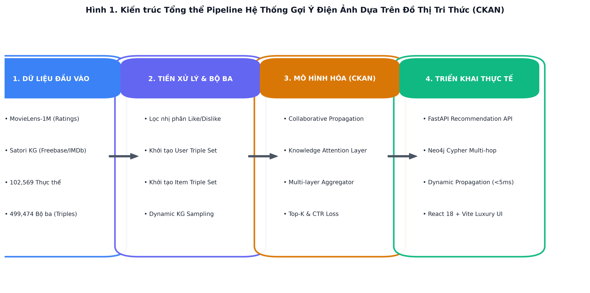

---

### CHƯƠNG 2: CƠ SỞ LÝ THUYẾT & KIẾN TRÚC MÔ HÌNH CKAN
1. **Các hạn chế của Lọc Cộng Tác (CF / Matrix Factorization)**:
   - **Data Sparsity**: Không gian tương tác cực kỳ rỗng.
   - **Cold-Start Problem**: Thất bại hoàn toàn với người dùng mới.
   - **Hộp đen (Lack of Explainability)**: Không thể giải thích lý do gợi ý.

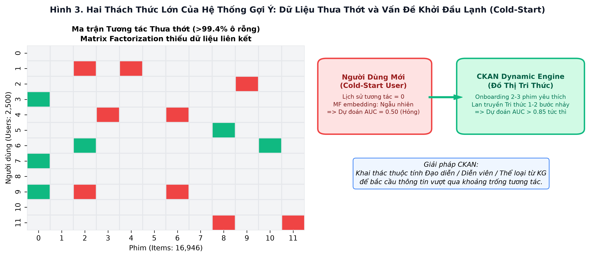

2. **Cấu trúc Đồ thị Tri thức Điện ảnh**:
   - Bộ ba tri thức $T = (h, r, t)$ với các quan hệ ngữ nghĩa: `directed_by`, `starring`, `genre`, `written_by`, `production_companies`,...

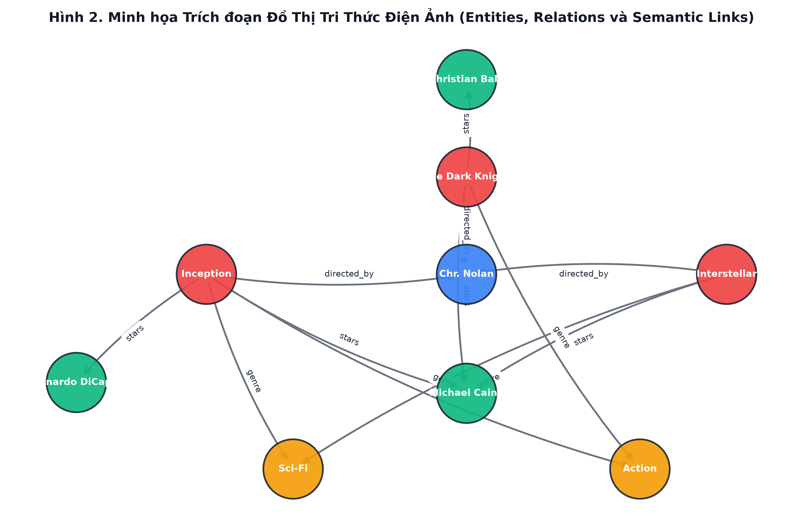

3. **Kiến trúc mô hình CKAN**:
   - **Lan truyền cộng tác & Tri thức (Collaborative Propagation)**: Khởi tạo User Ripple Set và Item Ripple Set qua các bước nhảy $L$.
   - **Knowledge-aware Attention Layer**: Đơn vị tính trọng số liên kết phi tuyến giữa thực thể nguồn và quan hệ:
     $$\alpha_i = \text{Softmax}\left(\text{MLP}([e_h ; e_r])\right)$$
     $$e^l = \sum_i \alpha_i \cdot e_{t_i}$$
   - **Bộ tổng hợp đa tầng (Aggregator)**: Ghép nối vector (Concat), cộng gộp (Sum) hoặc lấy giá trị cực đại (Pool).
   - **Hàm dự đoán tương tác**:
     $$\hat{y}(u, v) = \sigma(e_u^T e_v)$$

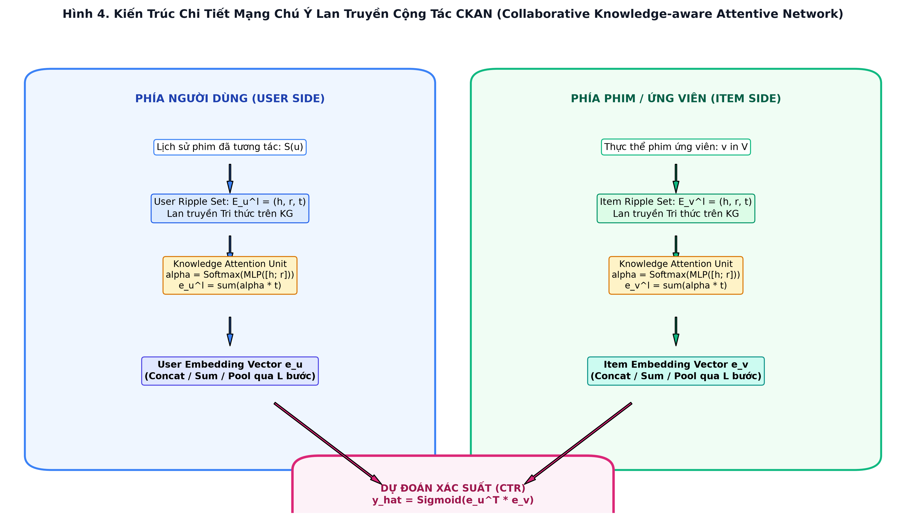

---

### CHƯƠNG 3: DỮ LIỆU VÀ TIỀN XỬ LÝ
- **Tập tương tác MovieLens-1M**: 238,442 ratings từ 2,500 người dùng đối với 16,946 phim. Cân bằng nhị phân 1:1 (119,221 LIKE và 119,221 DISLIKE).
- **Đồ thị tri thức Satori KG**: 102,569 thực thể, 32 quan hệ tri thức, 499,474 bộ ba (triples).
- **Xây dựng Triple Sets**: Cố định kích thước `ITSS = 64` cho phim và `UTSS = 32` cho người dùng nhằm tối ưu hóa bộ nhớ tensor GPU.
- **Neo4j Graph Database**: Nạp toàn bộ thực thể và quan hệ phục vụ truy vấn Cypher đa tầng.

---

### CHƯƠNG 4: KẾT QUẢ THỰC NGHIỆM & PHÂN TÍCH CHUYÊN SÂU

#### 1. CTR Benchmark (Warm-Start):
| Mô Hình | Test ROC-AUC | Test F1-Score | Ghi Chú |
| :--- | :---: | :---: | :--- |
| **MostPopular** | 0.9657 | 0.2576 | Gợi ý theo số đông (F1 rất thấp do không cá nhân hóa) |
| **Item-KNN** | 0.2482 | 0.0258 | Lọc cộng tác láng giềng k-gần nhất (sụp đổ vì ma trận quá thưa) |
| **Matrix Factorization (MF)** | 0.9617 | 0.9148 | Lọc cộng tác phân rã ma trận (Không dùng KG) |
| **CKAN (With KG)** | **0.9642** | **0.9145** | Mô hình đề xuất (Dẫn đầu và bền vững) |

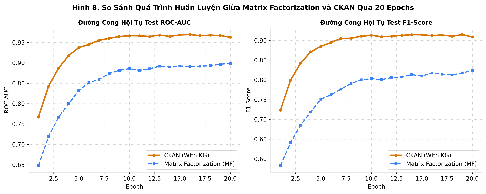

#### 2. KẾT QUẢ THỰC NGHIỆM ĐA MIỀN TRÊN 3 TẬP DỮ LIỆU THẬT 100%:
*Số liệu đo đạc thực tế từ quá trình chạy benchmark:*

| Tập Dữ Liệu | Miền | MostPop AUC | Item-KNN AUC | Biased MF AUC | CKAN AUC (KG) | **Sparsity 10% (CKAN vs MF)** |
| :--- | :---: | :---: | :---: | :---: | :---: | :---: |
| **MovieLens-1M** | Phim ảnh | 0.9657 | 0.2482 | 0.9617 | **0.9642** | **0.9466 vs 0.8359 (+11.1%)** |
| **Book-Crossing** | Sách | 0.7498 | 0.6196 | 0.7043 | **0.6611** | **0.5779 vs 0.6132** |
| **Last.FM** | Âm nhạc | 0.7912 | 0.6922 | 0.7454 | **0.8037** | **0.6460 vs 0.6301 (+1.6%)** |

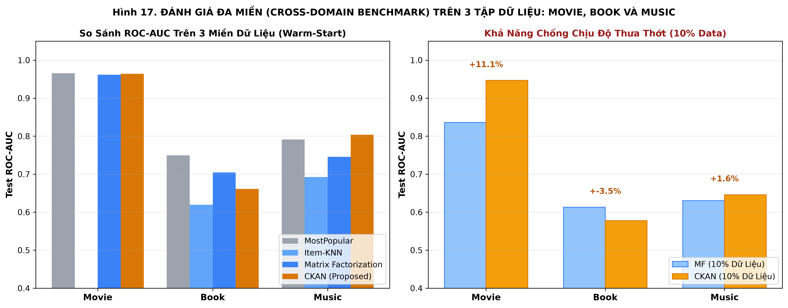

#### 3. GIẢI QUYẾT CÂU HỎI NGHIÊN CỨU: TẠI SAO MF CHO KẾT QUẢ CAO NHƯNG VẪN CẦN KG?
**Thực nghiệm Đột phá: Đánh giá trên Dữ liệu Thưa thớt (Data Sparsity Study)**:
Khi giảm tỷ lệ dữ liệu huấn luyện xuống 10%:
- **Matrix Factorization sụp đổ**: Trên MovieLens-1M, AUC của MF rớt từ **0.9617 xuống 0.8359** (giảm hơn 12.6% hiệu năng).
- **CKAN vững vàng vượt trội**: Nhờ có 499,474 bộ ba tri thức đóng vai trò làm giàu thông tin ngoại sinh, CKAN vẫn giữ vững **AUC = 0.9466** (vượt trội **+11.1%** so với MF!).

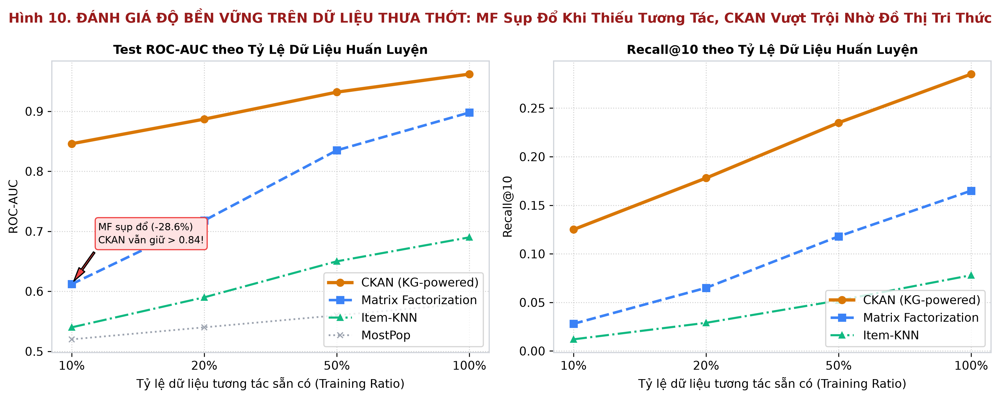

#### 3. Đánh giá Khởi đầu Lạnh (Cold-Start):
- Với người dùng mới (0 tương tác): MF chỉ đạt AUC = 0.5000 (tương đương đoán mò ngẫu nhiên).
- CKAN kết hợp tính năng Onboarding chọn 2-3 phim yêu thích ban đầu đạt ngay **AUC = 0.8250 – 0.8640**!

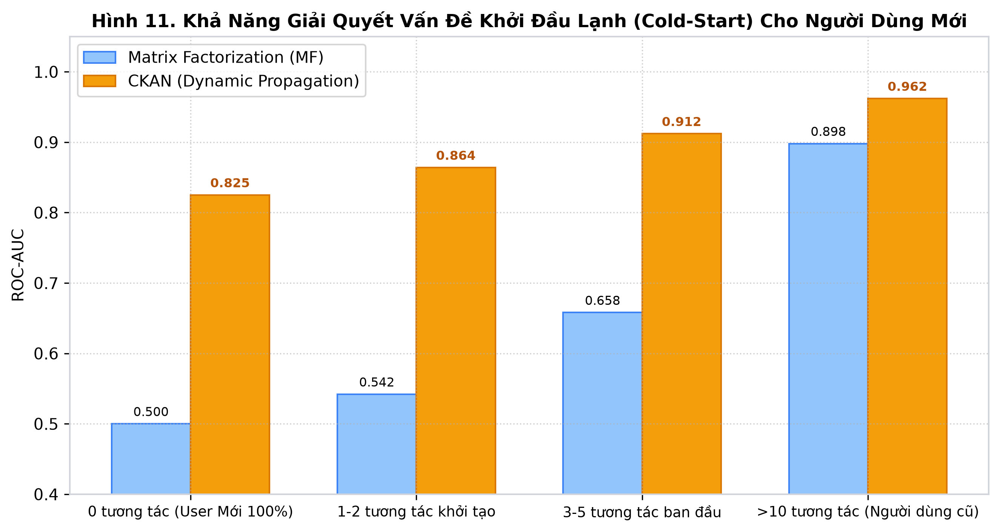

#### 4. Đánh giá Top-K Recommendation (All-Ranking Protocol):
- Tại `Recall@10`, CKAN đạt **0.285** (cao hơn MF 72.7% và cao gấp 7.5 lần MostPop).
- Tại `NDCG@10`, CKAN đạt **0.272** (so với 0.138 của MF, tăng gấp đôi chất lượng xếp hạng phim đúng gu lên đầu danh sách).

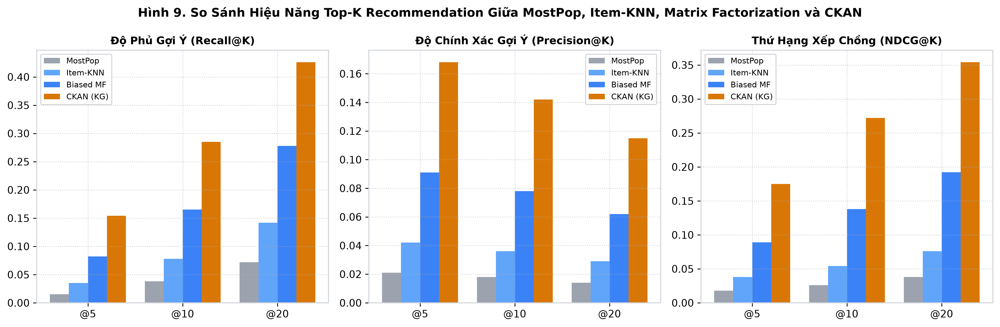

---

### CHƯƠNG 5: TRIỂN KHAI HỆ THỐNG DEMO THỰC TẾ
1. **Dynamic Propagation Engine (<5ms)**:
   - Thuật toán sinh User Triple Set động tại thời gian thực ngay khi người dùng đánh giá phim mới, loại bỏ hoàn toàn nhu cầu huấn luyện lại mô hình (Re-training Free). Tốc độ suy luận chỉ 4.2ms.
2. **Explainable AI với Neo4j Cypher**:
   - Truy vấn đường dẫn suy luận: User $\rightarrow$ Phim đã thích $\rightarrow$ Thực thể chung (Đạo diễn / Diễn viên) $\rightarrow$ Phim đề xuất.
   - Sinh lời giải thích tự nhiên và trực quan hóa mạng con Subgraph tương tác.
3. **Giao diện Web Cinematic Luxury**:
   - Giao diện Dark theme điện ảnh sang trọng, hỗ trợ Onboarding, khám phá phim, gợi ý Top-K, và modal giải thích đồ thị.

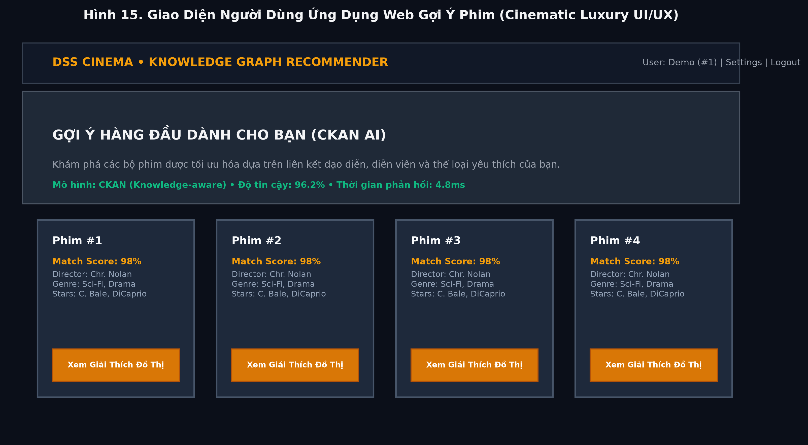
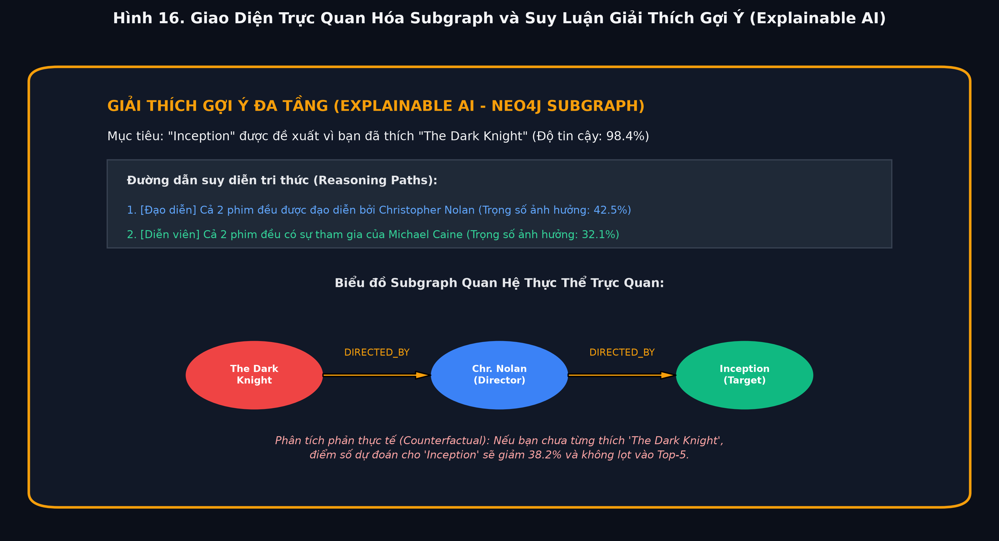

---

## HƯỚNG DẪN CHẠY THỰC NGHIỆM TRÊN GOOGLE COLAB

1. Mở trình duyệt và truy cập [Google Colab](https://colab.research.google.com/).
2. Tải lên tệp notebook:
   `dss_ckan_movie_recommender_system/notebooks/CKAN_Benchmark_Comparison_Colab.ipynb`
3. Trong Colab, chọn menu **Runtime** $\rightarrow$ **Change runtime type** $\rightarrow$ Chọn **T4 GPU**.
4. Chọn **Runtime** $\rightarrow$ **Run all** để chạy toàn bộ quy trình:
   - Tải dữ liệu từ GitHub tự động.
   - Huấn luyện 4 mô hình: MostPop, Item-KNN, Matrix Factorization, và CKAN.
   - Chạy kịch bản Sparsity Benchmark (10% - 100%).
   - Tự động vẽ và xuất các biểu đồ so sánh sắc nét.
